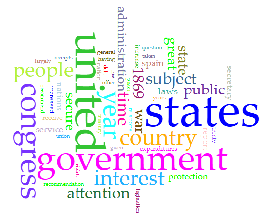



# Distant Reading Assignment 

Using the Corpus of Political Speeches, I found [Ulysses S Grant's First Annual Message from 1969](https://digital.lib.hkbu.edu.hk/corpus/)!

Using the Voyant tools, I can analyze a lot about patterns in the text including most common words, most frequent sentence combinations. 

Here's a picture of my most common words!

I also used Copilot to get information about the text! Here are some highlights of our conversation. 

Me: What are the most frequent words and are they actually the most important to the text’s meaning?

Copilot: Top 10 Most Frequent Words and Their Counts
government: 28 | states: 26 | public: 24 | debt: 21 | currency: 19 | laws: 17 | reconstruction: 16 | people: 15 | union: 14 | administration: 13

Summary: The most frequent words in Grant's First Annual Message—such as government, states, public, debt, and currency—reflect the speech's focus on national recovery, governance, and economic stability. These terms are indeed central to the message’s meaning, emphasizing reconstruction, public finance, and unity in the post-Civil War era.

Me: Are there a lot of subtleties that can be missed when condensing a text like this? If yes, list an example from the text.

Copilot: Yes, condensing a text like Ulysses S. Grant’s First Annual Message can easily miss important subtleties. While summaries capture the main themes—like government reform, public debt, and Reconstruction—they often lose the tone, nuance, and specific policy reasoning that give the message its full meaning.

Example of a Subtlety That Can Be Missed:
Grant writes:

“The country having just emerged from a great rebellion, many of whose citizens were for years in arms against the Government, it is to be expected that in such localities prejudice should exist against officers of the law who served during the war, or who were appointed to positions in their localities on account of their known loyalty to the Union.”

This passage subtly acknowledges the emotional and political tensions in post-war Southern states. It’s not just about enforcing law—it’s about navigating deep-seated mistrust, regional resentment, and the fragile legitimacy of federal authority in areas recently in rebellion. A summary might simply say “Grant discusses Reconstruction challenges,” but that would miss the delicate balance he’s trying to strike between justice and reconciliation.
